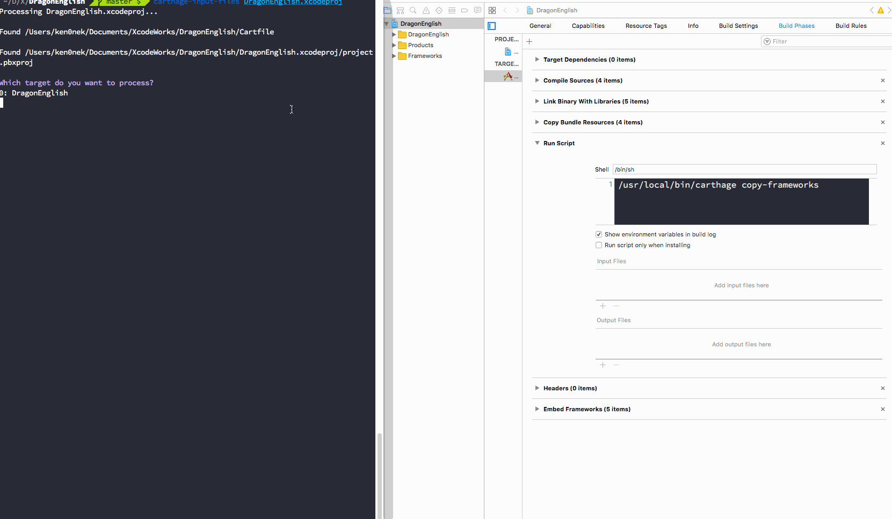

# CarthageInputFiles

This command lets you free from setting framework paths every time when using `Carthage`.

You don't have to write manually `$(SRCROOT)/Carthage/Build/iOS/*.framework` any more :)



## Usage

Add `Run Script` for `Carthage` in Xcode.

`/usr/local/bin/carthage copy-frameworks`

```swift
carthage update
carthage-input-files YourXcodeProject.xcodeproj
```

## Installation

- Clone this repository

`git clone https://github.com/ken0nek/CarthageInputFiles.git`

or

`git clone git@github.com:ken0nek/CarthageInputFiles.git`

- Make

`make install`

`carthage-input-files` command will be moved to `/usr/local/bin` by default

## Little tricks

After executing `carthage-input-files` command, you will see huge diff in `project.pbxproj` because of format.
This problem will be fixed by editing some settings.

For example, click `+` and then click `-` :P


## Future features

- [ ] Write only new frameworks
- [ ] Specify target
- [ ] Add Run Script for Carthage
